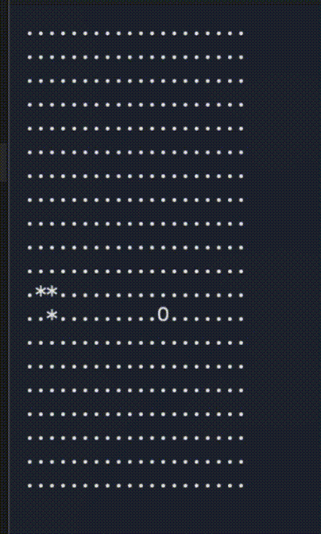

# Terminal Snake (C++)



A simple console-based Snake game written in modern C++.  
This is a **learning project** created while transitioning from C#/Unity to C++ — part of my preparation for systems-level programming and game engine development.

> 🐍 **Note**: This is not a polished product — it's a **study exercise** to practice terminal I/O, memory management, and clean C++ architecture.

---

## Features

- Real-time keyboard input using raw terminal mode (`termios`, `fcntl`)
- ANSI escape sequences for screen clearing and cursor control
- Toroidal (wrap-around) game board
- Collision detection (self-collision only)
- Food generation in free cells
- Score tracking

---

## Build & Run

> Tested on macOS (Apple Silicon) and Linux. Windows (via WSL) should also work.

### Requirements
- CMake ≥ 3.10
- C++17-compatible compiler (e.g., clang++ or g++)

### Build
```bash
mkdir build
cd build
cmake ..
cmake --build .
```

### Run
```bash
./SnakeGame
```
💡 The executable is named SnakeGame (as defined by your CMake project name).

### Controls
 - WASD — change snake direction
 - Q — quit immediately

### Known Issues & Learning Notes
This project contains intentional and unintentional imperfections that reflect my current learning stage:

🔄 Input handling: pollKey() temporarily reconfigures terminal settings — this may interfere with raw mode stability. (Planned fix: manage terminal state once in constructor/destructor only.)
🕹️ Game loop logic: Movement and food collision checks are slightly out of order — may cause one-frame lag in growth.
🐛 Snake growth: Uses a fragile "append behind tail" method instead of a cleaner grow flag.
📦 Headers: Some use using namespace std; — will be removed in future refactors.

### License
MIT — feel free to learn from it!